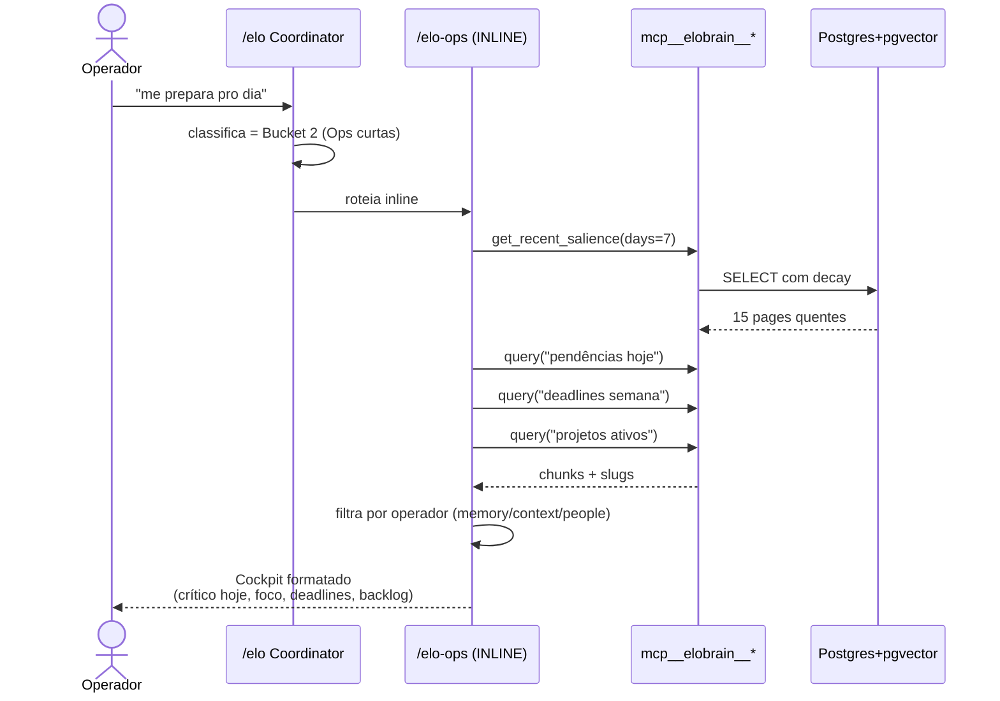
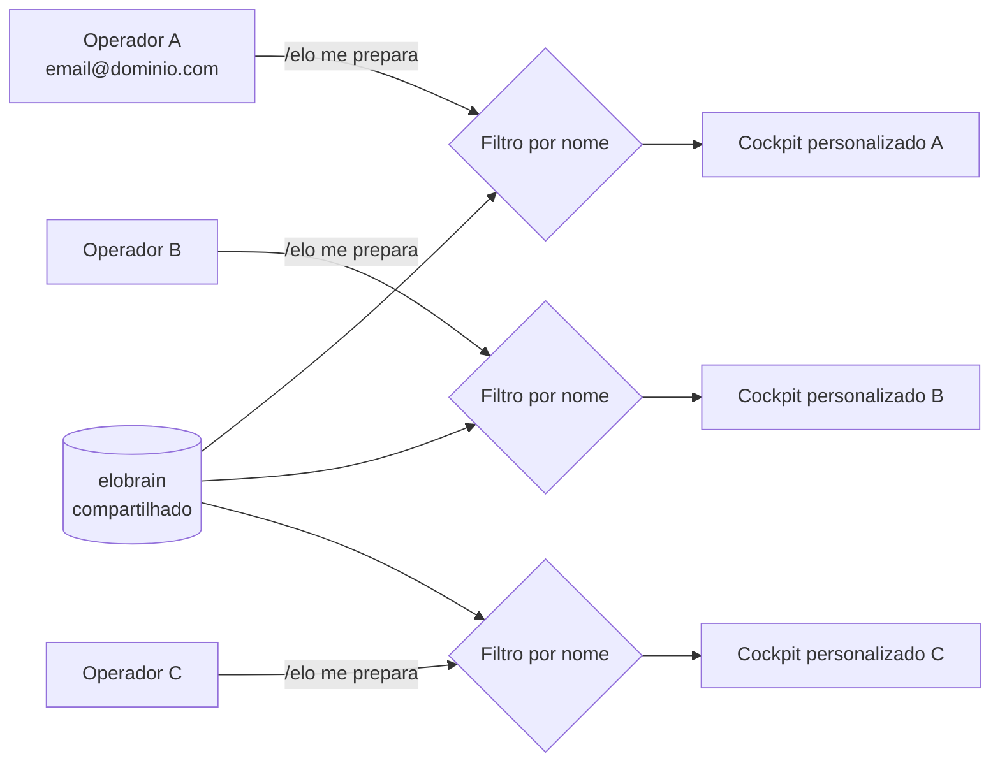

# elobrain — Architecture Overview

> Mapa de alto nível da stack elobrain. Pra detalhes técnicos por subsistema, ver os documentos especializados linkados ao longo do texto.

**Última atualização:** 12/05/2026 · **Linguagem:** PT-BR · **Upstream:** [`garrytan/gbrain`](https://github.com/garrytan/gbrain)

---

## TL;DR

**elobrain** é um produto comercial da Eloscope que entrega segundo cérebro operacional pra PMEs. É um fork do `gbrain` (Garry Tan) com camada de orquestração própria em PT-BR.

A stack tem **6 camadas** (5 visíveis ao usuário + 1 de infra):

```
┌──────────────────────────────────────────────────────────┐
│  Camada 5 — Interface (chat Claude Code / CLI / MCP)     │
├──────────────────────────────────────────────────────────┤
│  Camada 4 — Coordinator /elo (classifica intent PT-BR)   │
├──────────────────────────────────────────────────────────┤
│  Camada 3 — 4 Directors temáticos                        │
│    /elo-brain · /elo-ops · /elo-content · /elo-vendas    │
├──────────────────────────────────────────────────────────┤
│  Camada 2 — 48 Skills atômicas                           │
├──────────────────────────────────────────────────────────┤
│  Camada 1 — Tools MCP (mcp__elobrain__*)                 │
├──────────────────────────────────────────────────────────┤
│  Camada 0 — Infra (Postgres + pgvector + OpenAI +        │
│    daemon sync 15/15min) — ver [infra-layer]             │
└──────────────────────────────────────────────────────────┘
```

**Contrato fundamental:** o **repo markdown (`brain`) é a fonte de verdade**. O Postgres é cache derivado. `gbrain sync && gbrain extract all` reconstrói tudo. Detalhes em [system-of-record](architecture/system-of-record.md).

---

## Árvore de orquestração `/elo`

Quem comanda o quê. O Coordinator no topo, 4 Directors temáticos abaixo, skills/sub-agentes na base:

```mermaid
graph TD
    User([Operador<br/>fala em PT-BR])
    User --> Elo["/elo<br/>Coordinator<br/>classifica intent"]

    Elo --> EB["/elo-brain<br/>memória/conhecimento"]
    Elo --> EO["/elo-ops<br/>operação interna"]
    Elo --> EC["/elo-content<br/>produção"]
    Elo --> EV["/elo-vendas<br/>sales/GTM"]
    Elo -.bucket 5/6.-> Direct["skill atômica direta<br/>(passa sem Director)"]

    EB --> EB1[/query/]
    EB --> EB2[/ingest/]
    EB --> EB3[/recall/]
    EB --> EB4[/idea-ingest/]

    EO --> EO1[/cerebro/]
    EO --> EO2[/salve/]
    EO --> EO3[/rotina/]
    EO --> EO4[/sync/]
    EO --> EO5[/meeting/<br/>sub-agent Fathom]

    EC --> EC1[/carrossel-eloscope/]
    EC --> EC2[/publish/]
    EC --> EC3[/book-mirror/<br/>sub-agent]
    EC --> EC4[/brain-pdf/]

    EV --> GOS["/gos-mission-control<br/>Diretor GOS<br/>(sub-agent)"]
    GOS --> G1[gos-nicho-explorer]
    GOS --> G2[gos-cliente-radar]
    GOS --> G3[gos-lp-builder]
    GOS --> G4[gos-pitch-deck-builder]
    GOS --> G5[gos-gtm-architect]
    GOS --> G6[gos-playbook-vendas]
    GOS -.audita.-> GC[critic-nicho<br/>critic-lp<br/>critic-deck<br/>critic-playbook]

    classDef coord fill:#1e3a8a,color:#fff,stroke:#fff
    classDef director fill:#7c3aed,color:#fff,stroke:#fff
    classDef gosdir fill:#0891b2,color:#fff,stroke:#fff
    classDef skill fill:#1f2937,color:#e5e7eb,stroke:#4b5563
    classDef critic fill:#7c2d12,color:#fff,stroke:#fff
    class Elo coord
    class EB,EO,EC,EV director
    class GOS gosdir
    class EB1,EB2,EB3,EB4,EO1,EO2,EO3,EO4,EO5,EC1,EC2,EC3,EC4,G1,G2,G3,G4,G5,G6,Direct skill
    class GC critic
```

**Como ler:**
- **Setas cheias** — invocação direta (Coordinator → Director → skill).
- **Setas pontilhadas** — atalho ou validação (skill atômica sem Director / auditores pós-execução).
- **Cores:** azul-escuro = Coordinator · roxo = Directors elobrain · ciano = Diretor GOS (importado) · cinza = skills/funcionários · marrom = auditores.

**Princípio:** cada Director **só conhece suas próprias skills**. O Coordinator é o único com visão global. Skills nunca chamam outras skills — só o Director coordena. Isso isola contexto e evita cascata de erros.

---

## Componentes principais

### Camada 0–1 — Infra + MCP

O `elobrain` core (Bun + TypeScript + Supabase/Postgres) faz:
- **Sync daemon** — mantém vault markdown ↔ Postgres em sincronia (15min/15min por padrão)
- **Embeddings** — `text-embedding-3-small` da OpenAI (1536 dim) para vector search
- **Hybrid search** — pgvector + FTS (BM25) combinados via Reciprocal Rank Fusion
- **Knowledge graph** — links tipados entre pages (concepts/people/projects/decisions)
- **MCP server** — expõe ~30 tools (`query`, `search`, `get_page`, `put_page`, `get_recent_salience`, `traverse_graph`, etc.) pra qualquer cliente MCP

Detalhes técnicos:
- [`docs/architecture/infra-layer.md`](architecture/infra-layer.md) — data pipeline + search architecture
- [`docs/architecture/system-of-record.md`](architecture/system-of-record.md) — contract de fonte de verdade
- [`docs/architecture/brains-and-sources.md`](architecture/brains-and-sources.md) — modelo conceitual brain × source
- [`docs/architecture/topologies.md`](architecture/topologies.md) — deployment topologies (PGLite vs Postgres etc)

### Camada 2 — 48 Skills atômicas

Cada skill é um arquivo `SKILL.md` autocontido em `~/.claude/skills/<name>/`. Cobrem: briefing, query, ingest, enrich, carrossel, salve, rotina, meeting, book-mirror, citation-fixer, soul-audit, e mais. Lista canônica e instalação descritas em [`INSTALL_FOR_AGENTS.md`](../INSTALL_FOR_AGENTS.md).

### Camada 3 — 4 Directors temáticos

| Director | Domínio | Quando usa SUB-AGENT (longo) |
|---|---|---|
| `/elo-brain` | Memória/conhecimento (search, ingest, recall) | Sempre INLINE (rápido) |
| `/elo-ops` | Operação interna (cockpit, salve, sync, reuniões) | SUB-AGENT pra processar Fathom |
| `/elo-content` | Produção (carrossel, PDF, publish) | SUB-AGENT pra book-mirror |
| `/elo-vendas` | Sales/GTM — delega ao `/gos-mission-control` (Growth OS Skills) | Sempre SUB-AGENT (pipeline 8+ skills) |

Cada Director **começa obrigatoriamente** com uma chamada `mcp__elobrain__*` pra puxar contexto antes de executar — garante grounding no brain e evita alucinação.

### Camada 4 — Coordinator `/elo`

Recebe linguagem natural em PT-BR, classifica em 7 buckets de intent, e roteia pro Director certo (inline ou sub-agent conforme o caso).

```mermaid
flowchart TD
    In[Operador digita /elo &lt;objetivo&gt;]
    In --> Classify{Classifica intent<br/>7 buckets}

    Classify -->|"1 Brain<br/>buscar, ingerir"| B1[/elo-brain<br/>INLINE]
    Classify -->|"2 Ops curtas<br/>cockpit, salve"| B2[/elo-ops<br/>INLINE]
    Classify -->|"2.5 Ops longas<br/>reunião Fathom"| B25[/elo-ops<br/>SUB-AGENT]
    Classify -->|"3 Content curto<br/>carrossel"| B3[/elo-content<br/>INLINE]
    Classify -->|"3.5 Content longo<br/>book-mirror"| B35[/elo-content<br/>SUB-AGENT]
    Classify -->|"4 Vendas<br/>LP, deck, GTM"| B4[/elo-vendas<br/>SUB-AGENT]
    Classify -->|"5 Skill atômica<br/>usuário citou nome"| B5[Passa direto]
    Classify -->|"6 Meta<br/>maintain"| B6[Skill INLINE]
    Classify -->|"7 Out-of-scope"| B7[Recusa]
```

Pattern: **Anthropic orchestrator-worker**. Sub-agents preservam contexto da sessão principal de poluição por tarefas longas.

### Camada 5 — Interface

- **Claude Code chat** — primário; `/elo` é a porta de entrada
- **CLI** — `elobrain init`, `elobrain sync --repo <path>`, `elobrain rebuild`
- **MCP client** — qualquer cliente MCP (não só Claude) pode consumir `mcp__elobrain__*`

---

## Fluxo integrado — exemplo real

**Pedido:** *"me prepara pro dia"* (operador qualquer, 8h da manhã)



---

## Multi-operador (time compartilhado)

O brain pode ser compartilhado entre múltiplas pessoas via Supabase compartilhado. Cada operador é identificado por email (cruzando `userEmail` do ambiente com `memory/context/people.md`), e o briefing é filtrado pela coluna "Responsável" das pendências/deadlines.



Diários individuais ficam em `time/{nome}/diario/YYYY-MM-DD.md` no brain.

---

## Anti-patterns críticos

1. **Não ler markdown raw do brain pra análise.** Sempre passar pelo MCP (`mcp__elobrain__query`, `get_page`, etc). Leitura raw inunda contexto e perde ranking semântico.
2. **Sub-agents devem começar com `mcp__elobrain__*`** — escapa hooks de `context-mode` que interceptariam `Read`/`Bash`/`WebFetch`.
3. **Nunca confiar no DB como source of truth.** É cache derivado. Recovery = re-import do markdown. Ver [system-of-record](architecture/system-of-record.md).
4. **Não misturar brain (--brain) com source (--source).** São axes ortogonais — confundir gera misroute silencioso. Ver [brains-and-sources](architecture/brains-and-sources.md).

---

## Setup rápido

Ver [`README.md`](../README.md) (Quick start) — não duplicar aqui.

Resumo:
1. `git clone` + `bun install && bun link`
2. Configurar `~/.elobrain.env` com `OPENAI_API_KEY` + `GBRAIN_DATABASE_URL`
3. Habilitar pgvector no Supabase + criar schema `elobrain`
4. `elobrain init` + `elobrain sync --repo ~/seu-vault`
5. (Opcional) Registrar MCP no Claude Code

---

## Roadmap arquitetural

- **v0.3 atual** — orquestração híbrida inline/sub-agent
- **Próximo** — memória de classificações (Coordinator aprende com histórico)
- **Próximo** — OpenClaw integration (agentes rodando fora do laptop)
- **Próximo** — refinar deployment topologies pra time grande (>10 pessoas)

---

## Referências cruzadas

- [README principal](../README.md)
- [`docs/architecture/brains-and-sources.md`](architecture/brains-and-sources.md) — modelo brain × source
- [`docs/architecture/infra-layer.md`](architecture/infra-layer.md) — data pipeline + search
- [`docs/architecture/system-of-record.md`](architecture/system-of-record.md) — contrato de fonte de verdade
- [`docs/architecture/topologies.md`](architecture/topologies.md) — decision tree de deployment
- [`docs/ENGINES.md`](ENGINES.md) — engines de chunking/embedding
- [`docs/mcp/`](mcp/) — tools MCP detalhadas
- [`AGENTS.md`](../AGENTS.md) — convenções dos agents
- [`CONTRIBUTING.md`](../CONTRIBUTING.md) — guia de contribuição

---

*Documento mantido por: time Eloscope + contribuidores. Sugestões: PR direto.*
